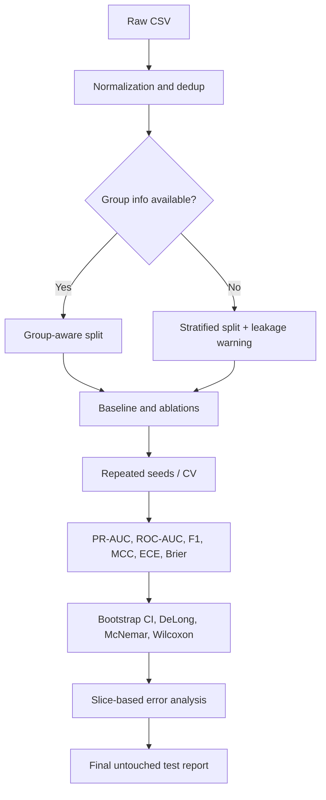

# Улучшение GINE-модели для классификации malware и benign по API-последовательностям

## Executive summary

Текущее решение уже является разумным edge-aware baseline: из CSV строятся графы по порядку вызовов API, узлы кодируются one-hot по словарю, затем проходят через `Linear`-энкодер, стек `GINEConv`, `global_add_pool` и бинарный классификатор; обучение идёт с обычной `cross_entropy`, а на инференсе используется фиксированный порог 0.5. При этом граф строится в основном из рёбер `i→i+1`, опционально обратных и `i→i+2`, а в `predict_gine.py` архитектура восстанавливается частично по имени файла, причём `edge_dim` жёстко зафиксирован как 3. fileciteturn0file2L57-L79 fileciteturn0file2L82-L121 fileciteturn0file3L18-L49 fileciteturn0file5L29-L44 fileciteturn0file5L73-L113 fileciteturn0file0L91-L96 fileciteturn0file0L324-L380

Мой главный вывод: потолок качества у текущего решения задаётся не столько самим `GINEConv`, сколько фронтендом признаков, слабой экспликацией порядка/дальних зависимостей и слишком «жёсткой» operational-логикой обучения и принятия решения. Поэтому максимальный ROI дают три направления: усилить представление токенов API, сделать граф и readout более order-aware, и отдельно стабилизировать обучение/калибровку под malware/benign-задачу. Это согласуется и с литературой по GIN/GINE, и с работами по API-sequence malware detection, где семантика API, temporal-структура и корректный operating point оказываются критичнее простого увеличения глубины сети. citeturn0search9turn1search0turn10search1turn10search4turn10search6turn7search1

| Метод | Краткая идея | Ожидаемый эффект | Основной риск | Вычислительная цена | Сложность внедрения | Приоритет |
|---|---|---:|---|---|---|---|
| Плотные семантические эмбеддинги API | Убрать one-hot фронтенд как bottleneck по памяти и добавить pretraining/subtoken-sharing | +1–4 п.п. по F1 или PR-AUC; заметное уменьшение памяти на входе | Если заменить только one-hot на случайный `Embedding`, quality gain может быть почти нулевым | Низкая–средняя; pretraining добавляет отдельный этап | Средняя | **Высокий** |
| Обогащение графа временем и структурой | Вернуть модели явный порядок, масштабы переходов и более сильный graph readout | +1–3 п.п., особенно на длинных трассах и редких шаблонах | Рост числа рёбер и риска overfitting | Средняя–высокая | Средняя–высокая | **Средний** |
| Cost-sensitive обучение и калиброванное решение | Подстроить loss, метрики, порог и калибровку под malware-задачу | +1–5 п.п. по threshold-dependent метрикам; меньше ложных тревог при той же полноте | Переобучение operating point на validation | Низкая на одну тренировку, высокая на полный benchmarking | Низкая–средняя | **Высокий** |

Оптимальная последовательность внедрения: сначала метод с семантическими эмбеддингами и метод с корректной operational-логикой, затем — структурное расширение графа. Причина проста: первый шаг почти не ломает backbone, а третий немедленно делает итоговые метрики и deployment-поведение надёжнее; второй шаг даёт наибольшую архитектурную прибавку, но требует более глубокого рефакторинга. citeturn1search0turn6search2turn7search1turn14search1

## Диагностика текущего базового решения

По приложенным файлам видно несколько важных особенностей, которые определяют стратегию улучшений. Во-первых, признаки узла сейчас формируются как плотная матрица one-hot размера `[число_вызовов, vocab_size]`, после чего линейный слой переводит её в `hidden_dim`. Во-вторых, порядок в графе кодируется только структурой локальных рёбер и коротких skip-дуг; явных позиционных признаков узла нет. В-третьих, top-level readout — это суммирование по узлам, а значит всё, что модель знает о порядке, должно уже быть «упаковано» в самих node embeddings ещё до pooling. В-четвёртых, training loop оптимизирует plain cross-entropy и выбирает checkpoint по `val_f1`, вычисленному при argmax, а prediction-time threshold 0.5 вынесен в отдельный скрипт и не связан с логикой выбора лучшей модели. fileciteturn0file2L74-L79 fileciteturn0file2L82-L121 fileciteturn0file3L18-L49 fileciteturn0file5L47-L70 fileciteturn0file5L86-L113 fileciteturn0file0L61-L72 fileciteturn0file0L349-L380

Есть и несколько технических зон «неуточнено». В `train_gine.py` используются `dataset_adapters` и `utils`, а в `predict_gine.py` — `data_io`, но сами эти файлы не приложены; поэтому детали предобработки CSV, эвристик выбора колонок, возможной дедупликации и части вспомогательной сериализации должны считаться «неуточнено». Кроме того, split производится на уровне строк с учётом только label-stratification; если в CSV есть связанные между собой образцы, семейства, дубликаты или варианты одного и того же объекта, текущая схема может давать optimistic leakage, но наличие таких групп в данных по коду не видно. fileciteturn0file4L17-L22 fileciteturn0file2L169-L191 fileciteturn0file0L16-L18 citeturn14search1turn14search3

С архитектурной точки зрения это не «плохой» GNN, а скорее недонасыщенный данными GNN. Работа Xu et al. про GIN объясняет, почему sum-based aggregation и injective message passing вообще конкурентоспособны; работа Hu et al. про GINE показывает, что edge-aware вариант естественно подходит, когда рёбра сами несут смысл; а последующие работы по graph pooling и positional encodings показывают, что граф-level задаче недостаточно только локального message passing без более сильного readout и явной структуры порядка. В malware-литературе тот же паттерн повторяется: sequence- и graph-based методы заметно выигрывают, когда модель получает семантику API и temporal/structural контекст, а не только голые идентификаторы токенов. citeturn0search9turn1search0turn6search2turn13search1turn10search1turn10search6turn22search0

Общий prerequisite перед методами ниже: перестать сохранять «голый» `state_dict` и перейти на checkpoint-словарь, в котором лежат `model_args`, `edge_dim`, `vocab_size`, `threshold`, `temperature` и версия схемы. Это обязательно для методов с новыми edge features и pooling, потому что сейчас train-код берёт `edge_dim` из данных, а inference-код жёстко создаёт модель с `edge_dim=3` и пытается извлечь `hidden_dim/num_layers` из имени файла. fileciteturn0file4L270-L297 fileciteturn0file0L91-L96 fileciteturn0file0L324-L336

```mermaid
flowchart LR
    A[CSV с API-последовательностями] --> B[Токенизация и словарь]
    B --> C[Семантический энкодер API]
    C --> D[Граф с temporal и structural edge features]
    D --> E[GINE-блоки + Jumping Knowledge]
    E --> F[Attentive или GMT pooling]
    F --> G[Классификатор]
    G --> H[Temperature scaling]
    H --> I[Thresholded решение malware/benign]
```



## Плотные семантические эмбеддинги API

Самый безопасный и самый практичный апгрейд — перестроить фронтенд узлов. Важная тонкость: чистая замена `one-hot + Linear` на случайно инициализированный `Embedding` почти не меняет выразительность, потому что линейный слой над one-hot уже фактически реализует таблицу эмбеддингов API-токенов. Поэтому реальный прирост качества даёт не сама замена типа слоя, а то, что после неё становятся возможны предобучение на неразмеченных API-последовательностях, subtoken-sharing между редкими и похожими API, а также компактное добавление side-features вроде позиции в трассе и log-frequency. В вашей реализации это особенно важно, потому что словарь строится прямо по токенам API, а редкие события могут сливаться в `<UNK>` при росте `min_token_freq`; при этом one-hot матрица масштабируется как `O(n·|V|)` по памяти. fileciteturn0file2L57-L71 fileciteturn0file2L74-L79 fileciteturn0file3L18-L18 citeturn0search2turn19search0turn18search0turn10search1

Практический выигрыш здесь двоякий. По памяти это почти всегда улучшение: при длине последовательности 400 и словаре 5000 ваш one-hot вход уже занимает около 8 МБ на sample только под `x`, тогда как API ids занимают килобайты, а dense embeddings — `O(n·d)`. По качеству выигрыш появляется за счёт переноса семантики: соседние по смыслу или форме API начинают разделять параметры, а новая редкая API уже не выглядит как полностью независимая координата. Это особенно хорошо согласуется с malware-последовательностями, где word2vec/fastText-подобные представления и semantic encoding repeatedly улучшают API-based detection. citeturn0search2turn19search0turn18search0turn10search4turn10search11

**Что менять в коде.**  
В `graph_data.py` нужно перестать строить dense one-hot через `make_node_features` и начать сохранять либо `data.api_id`, либо компактный `x`, в котором первая колонка — integer id API, а остальные — числовые side-features. Минимальный набор side-features для старта: абсолютная позиция `i/L`, bucket позиции, `log1p(freq(api))`, признаки `is_first_occurrence` и `is_last_occurrence`. Если названия API несут морфологию (`CreateFileW`, `CreateFileA`, `RegOpenKeyExW`), добавьте subtokenization по CamelCase/символам и отдельный subtoken vocabulary. В `model.py` нужен отдельный `APINodeEncoder`, который объединяет `nn.Embedding(vocab_size, api_embed_dim)` с MLP для числовых признаков и, при желании, с усреднением subtoken embeddings. В `cli.py` нужно добавить параметры `--node-feature-mode`, `--api-embed-dim`, `--subtoken-dim`, `--pretrained-embeddings-path`, `--freeze-embeddings-epochs`. В `train_gine.py` и `predict_gine.py` нужно пробросить новые поля и сохранять конфиг в checkpoint, иначе воспроизведение модели будет хрупким. fileciteturn0file2L74-L79 fileciteturn0file1L43-L65 fileciteturn0file4L270-L297 fileciteturn0file0L324-L336

Пример минимального рефакторинга:

```python
# graph_data.py
def make_node_inputs(api_ids, local_freq):
    api_id = torch.tensor(api_ids, dtype=torch.long)
    n = len(api_ids)
    pos = torch.arange(n, dtype=torch.float32) / max(n - 1, 1)
    logf = torch.tensor([math.log1p(local_freq[a]) for a in api_ids], dtype=torch.float32)
    x_num = torch.stack([pos, logf], dim=1)  # [n, 2]
    return api_id, x_num

data = Data(
    api_id=api_id,
    x_num=x_num,
    edge_index=edge_index,
    edge_attr=edge_attr,
    y=y,
)
```

```python
# model.py
class APINodeEncoder(nn.Module):
    def __init__(self, vocab_size, api_embed_dim, num_dim, hidden_dim):
        super().__init__()
        self.api_emb = nn.Embedding(vocab_size, api_embed_dim, padding_idx=0)
        self.num_proj = nn.Sequential(
            nn.Linear(num_dim, api_embed_dim),
            nn.ReLU(),
            nn.Linear(api_embed_dim, api_embed_dim),
        )
        self.out = nn.Linear(api_embed_dim * 2, hidden_dim)

    def forward(self, api_id, x_num):
        tok = self.api_emb(api_id)
        num = self.num_proj(x_num)
        return self.out(torch.cat([tok, num], dim=-1))
```

```python
# trainer.py / predict_gine.py
logits = model(batch.api_id, batch.x_num, batch.edge_index, batch.edge_attr, batch.batch)
```

**Гиперпараметры для поиска.**  
Рекомендую небольшой, но содержательный grid: `api_embed_dim ∈ {64, 128, 256}`, `subtoken_dim ∈ {0, 32, 64}`, `min_token_freq ∈ {1, 3, 5}`, `freeze_embeddings_epochs ∈ {0, 1, 3}`, `dropout ∈ {0.1, 0.3, 0.5}`. Если делается предобучение word2vec/fastText: `window ∈ {4, 8, 16}`, `negative ∈ {5, 10}`, `epochs ∈ {5, 10}`. Если данных мало, сначала попробуйте trainable embeddings без pretraining, но с side-features; если данных много или есть доступ к неразмеченным последовательностям, именно pretraining должен стать главным вариантом. citeturn0search2turn19search0turn14search1

**Ожидаемый эффект, риски и цена.**  
Ожидаемый эффект — наиболее надёжный в сочетании «качество + память»: по качеству типично выигрывают long-tail vocab, редкие API и перенос на новые образцы; по вычислениям уменьшается фронтенд-память и ускоряется input pipeline. Основной риск — сделать слишком слабую версию метода, например только заменить one-hot на randomly initialized `Embedding` без pretraining и без side-features; тогда на метриках почти ничего не произойдёт. По трудоёмкости это средний рефакторинг, но он почти не затрагивает сами GINE-блоки. citeturn18search0turn10search1turn10search4turn10search11

**Ключевые статьи.**  
Mikolov et al., *Efficient Estimation of Word Representations in Vector Space* (2013, arXiv:1301.3781): базовый источник для предобучения dense token embeddings; полезен как простой и быстрый способ обучить API embeddings на сырых последовательностях. citeturn0search2  
Bojanowski et al., *Enriching Word Vectors with Subword Information* (2017, DOI 10.1162/tacl_a_00051): главный аргумент в пользу subtoken/character n-gram sharing для редких и OOV API. citeturn19search0turn19search7  
Amer & Zelinka, *A dynamic Windows malware detection and prediction method based on contextual understanding of API call sequence* (2020, DOI 10.1016/j.cose.2020.101760): показывает, что contextual embeddings API полезны именно в malware-домене, а не только в NLP. citeturn18search0turn18search5  
Li et al., *A novel deep framework for dynamic malware detection based on API sequence intrinsic features* (2022, DOI 10.1016/j.cose.2022.102686) и Maniriho et al., *API-MalDetect* (2023, DOI 10.1016/j.jnca.2023.103704): подтверждают, что dense semantic encoding API-последовательностей даёт реальный прирост на Windows malware detection. citeturn10search1turn10search4

## Обогащение графа временем и структурой

Ваш текущий граф уже использует GINE, а значит прямо поддерживает edge attributes; это большое преимущество, потому что усиливать здесь стоит не столько саму message-passing механику, сколько содержание рёбер и readout. Сейчас `edge_attr` — всего лишь one-hot индикатор трёх типов дуг, а число слоёв по умолчанию равно 3. При такой схеме каждый узел видит лишь локальный контекст вдоль sequence-графа; дальние зависимости и абсолютный порядок восстанавливаются плохо, особенно когда одна и та же API вызывается многократно в похожих локальных окружениях. `global_add_pool` при этом не «плохой», но task-agnostically суммирует набор узлов: если позиция и масштаб перехода не зашиты в node states до pooling, граф-level head практически не сможет их восстановить. fileciteturn0file2L97-L112 fileciteturn0file3L23-L49 fileciteturn0file1L55-L59 citeturn0search9turn1search0turn6search2turn16search11

Здесь я рекомендую bundle из трёх изменений, а не одно isolated tweak. Первое — добавить явные positional node features: хотя бы нормированную позицию, bucket позиции и, если позволяет бюджет, синусоидальные positional encodings малой размерности. Второе — сделать multi-scale temporal graph: вместо одного fixed skip `i→i+2` использовать набор stride-ов, например `{2, 4, 8}`, и включить в edge features относительное смещение, direction, bucket расстояния и тип ребра. Третье — заменить голый `global_add_pool` на `JumpingKnowledge + AttentionalAggregation` или другой task-aware pooling; это самый дешёвый способ вернуть модели информацию из нескольких масштабов без обязательного ухода в полноценный graph transformer. Такой upgrade особенно логичен именно на GINE, потому что GINE уже умеет работать с `edge_attr`, а JK и graph multiset/attention pooling хорошо согласуются с graph-level classification. citeturn1search1turn6search2turn5search4turn13search1

**Что менять в коде.**  
В `graph_data.py` расширьте `build_graph_from_sequence`: пусть `edge_attr` станет не трёхмерным one-hot, а более содержательным вектором, например `[is_fwd, is_bwd, is_skip, rel_dist, dist_bucket, is_virtual]`. Вместо флага `--add-skip-edges` добавьте `--skip-strides 2,4,8`; это даст более длинный effective receptive field без резкого роста глубины GNN. Также рекомендую добавить optional virtual node на граф: один дополнительный узел, двунаправленно связанный со всеми вызовами, чтобы head получал дешёвый канал глобального контекста. В `model.py` добавьте `JumpingKnowledge` и task-aware pooling; минимальный практический вариант — `AttentionalAggregation`, более тяжёлый — GMT. В `cli.py` нужны параметры `--pos-dim`, `--skip-strides`, `--use-virtual-node`, `--jk-mode`, `--pool {add,attention,set2set,gmt}`. В `predict_gine.py` обязательно перестаньте хардкодить `edge_dim=3`, иначе любая новая edge schema сломает inference. fileciteturn0file2L82-L121 fileciteturn0file3L19-L37 fileciteturn0file1L55-L59 fileciteturn0file0L328-L335

Пример практического рефакторинга:

```python
# graph_data.py
def build_graph_from_sequence(api_ids, label, skip_strides=(1, 2, 4, 8), undirected=False, use_virtual_node=False):
    edges, edge_attr = [], []
    L = len(api_ids)

    for stride in skip_strides:
        for i in range(L - stride):
            j = i + stride
            rel = stride / max(L - 1, 1)
            bucket = min(stride, 8) / 8.0
            edges.append([i, j])
            edge_attr.append([1.0, 0.0, float(stride > 1), rel, bucket, 0.0])
            if undirected:
                edges.append([j, i])
                edge_attr.append([0.0, 1.0, float(stride > 1), rel, bucket, 0.0])

    if use_virtual_node:
        v = L
        for i in range(L):
            edges += [[v, i], [i, v]]
            edge_attr += [[0.0, 1.0, 0.0, 1.0, 1.0, 1.0],
                          [1.0, 0.0, 0.0, 1.0, 1.0, 1.0]]
```

```python
# model.py
self.jk = JumpingKnowledge(mode=jk_mode)
pool_in = hidden_dim if jk_mode in {"last", "max"} else hidden_dim * num_layers
self.pool = AttentionalAggregation(
    gate_nn=nn.Sequential(
        nn.Linear(pool_in, pool_in // 2),
        nn.ReLU(),
        nn.Linear(pool_in // 2, 1),
    )
)

xs = []
for conv, bn in zip(self.convs, self.bns):
    x = conv(x, edge_index, edge_attr)
    x = bn(x)
    x = F.relu(x)
    x = F.dropout(x, p=self.dropout, training=self.training)
    xs.append(x)

x = xs[-1] if self.jk is None else self.jk(xs)
g = self.pool(x, batch)
return self.head(g)
```

**Гиперпараметры для поиска.**  
Начните с компактного поиска: `skip_strides ∈ {(1,2), (1,2,4), (1,2,4,8)}`, `pos_dim ∈ {8, 16, 32}`, `jk_mode ∈ {last, max, cat}`, `pool ∈ {add, attention}`, `num_layers ∈ {3, 4, 5}`, `hidden_dim ∈ {128, 256}`. Virtual node сначала включайте только на лучшей комбинации `skip_strides + pooling`; иначе search space быстро раздувается. Если dataset небольшой, `pool=attention` обычно разумнее GMT как первый шаг. citeturn1search1turn6search2turn5search4

**Ожидаемый эффект, риски и цена.**  
Это метод с наибольшей архитектурной прибавкой, но и с самым высоким шансом переусложнить систему. Он особенно полезен, если вредоносный паттерн определяется не локальными биграммами API, а сочетанием удалённых событий и их positions in trace. На длинных последовательностях и при повторяющихся API gains обычно выше. Основной риск — рост числа рёбер и нестабильность на small/medium data; если данных немного, модель может начать подстраиваться под артефакты позиции, а не под семантику поведения. По вычислениям стоимость растёт примерно линейно по числу добавленных рёбер, плюс открывается дополнительный overhead pooling-а. citeturn10search6turn22search0turn16search11

**Ключевые статьи.**  
Xu et al., *How Powerful are Graph Neural Networks?* (ICLR 2019, arXiv:1810.00826): базовая теория GIN и sum aggregation; релевантна как фундамент текущего backbone. citeturn0search9  
Hu et al., *Strategies for Pre-Training Graph Neural Networks* (ICLR 2020, arXiv:1905.12265): первоисточник GINE — edge-aware варианта GIN; это самая близкая к вашему коду архитектурная работа. citeturn1search0turn1search4  
Xu et al., *Representation Learning on Graphs with Jumping Knowledge Networks* (ICML 2018): сильная практическая мотивация для layer-wise aggregation и борьбы с ограниченным receptive field. citeturn1search1  
Baek et al., *Accurate Learning of Graph Representations with Graph Multiset Pooling* (ICLR 2021, arXiv:2102.11533): аргумент в пользу task-aware graph readout вместо простого sum/mean pooling. citeturn6search2  
Rampášek et al., *Recipe for a General, Powerful, Scalable Graph Transformer* (2022, arXiv:2205.12454): useful как recipe для следующего шага, если захочется hybrid local-global model поверх GINE. citeturn5search4  
Li et al., *TS-Mal* (2024, DOI 10.1016/j.cose.2024.103752) и Li et al., *DMalNet* (2022, DOI 10.1016/j.cose.2022.102872): malware-domain evidence, что temporal и structural признаки API-графов действительно работают. citeturn10search6turn22search0

## Cost-sensitive обучение и калиброванное решение

Третий метод — не «косметика», а критическая operational-надстройка. Сейчас trainer считает `accuracy`, `precision`, `recall`, `f1`, `roc_auc`, но оптимизируется plain CE, а checkpoint выбирается по `val_f1` при argmax-предсказании, то есть при implicit threshold 0.5. Затем отдельный prediction script уже накладывает порог `prob >= threshold`, но этот порог не участвует в model selection, а по умолчанию просто равен 0.5. Для malware/benign-задачи такая схема почти наверняка suboptimal: важны не только ranking metrics, но и operating point при ограничении на FPR или при повышенном весе recall, а современные нейросети часто плохо калиброваны. fileciteturn0file5L9-L26 fileciteturn0file5L73-L113 fileciteturn0file0L61-L72 fileciteturn0file0L269-L304 fileciteturn0file0L349-L380 citeturn7search1turn25search7

Для бинарной malware-задачи я рекомендую разделить это направление на три очень конкретных слоя. Первый слой — cost-sensitive loss: `weighted CE`, `focal loss`, а при сильном дисбалансе — class-balanced focal. Второй слой — threshold tuning на validation по целевой deployment-метрике: для balanced сценария это может быть `F1` или `MCC`; если для вас пропуск malware дороже ложной тревоги — `F2` или `recall @ fixed FPR`. Третий слой — calibration, лучше всего temperature scaling на validation logits. Результат этих шагов должен сохраняться вместе с checkpoint, а не передаваться вручную через CLI. Такой pipeline почти всегда даёт более полезную operational-кривую даже в тех случаях, когда ROC-AUC меняется слабо. citeturn7search4turn7search2turn7search1turn25search7turn22search0

**Что менять в коде.**  
В `trainer.py` добавьте фабрику loss-функций, поддержку `average_precision_score`/PR-AUC, `balanced_accuracy_score`, `matthews_corrcoef`, `brier_score_loss` и, если готовы, ECE. `evaluate()` должен возвращать вероятности и уметь считать threshold-dependent метрики для произвольного `threshold`, а не только argmax. В `train_gine.py` на каждом best-candidate checkpoint-е нужно: сохранить validation logits, подобрать лучшее `threshold`, затем отдельно обучить temperature scaler на validation set и сохранить `threshold` + `temperature` в checkpoint. В `predict_gine.py` — сначала load checkpoint dict, потом `probs = softmax(logits / T)`, и уже затем `pred = prob >= threshold`. В `cli.py` добавьте `--loss`, `--focal-gamma`, `--class-balance-beta`, `--select-metric`, `--threshold-grid`, `--calibration`. Если иногда используется `--no-internal-split`, его нужно исключить из research-экспериментов: без validation вы не сможете корректно выбрать ни threshold, ни calibration. fileciteturn0file5L29-L44 fileciteturn0file1L66-L70 fileciteturn0file4L222-L227 fileciteturn0file0L234-L304

Пример практического кода:

```python
# trainer.py
def weighted_focal_loss(logits, y, class_weights=None, gamma=2.0):
    ce = F.cross_entropy(logits, y, weight=class_weights, reduction="none")
    pt = torch.exp(-ce)
    return ((1.0 - pt) ** gamma * ce).mean()

def find_best_threshold(y_true, y_prob, metric="f1"):
    grid = np.linspace(0.05, 0.95, 37)
    best_t, best_s = 0.5, -1.0
    for t in grid:
        y_pred = (y_prob >= t).astype(int)
        if metric == "f1":
            s = f1_score(y_true, y_pred, zero_division=0)
        elif metric == "mcc":
            s = matthews_corrcoef(y_true, y_pred)
        elif metric == "f2":
            s = fbeta_score(y_true, y_pred, beta=2, zero_division=0)
        if s > best_s:
            best_t, best_s = t, s
    return best_t, best_s
```

```python
# train_gine.py
torch.save({
    "state_dict": model.state_dict(),
    "model_args": {
        "hidden_dim": args.hidden_dim,
        "num_layers": args.num_layers,
        "dropout": args.dropout,
        "edge_dim": edge_dim,
        "pool": args.pool,
    },
    "threshold": best_threshold,
    "temperature": best_temperature,
    "vocab_size": len(vocab),
}, save_path)
```

```python
# predict_gine.py
ckpt = torch.load(args.model_path, map_location=device)
model.load_state_dict(ckpt["state_dict"])
T = ckpt.get("temperature", 1.0)
thr = ckpt.get("threshold", args.threshold)
probs = torch.softmax(logits / T, dim=1)[:, 1]
preds = (probs >= thr).long()
```

**Гиперпараметры для поиска.**  
Для дисбаланса: `loss ∈ {weighted_ce, focal, cb_focal}`, `gamma ∈ {1, 2, 3}`, `beta ∈ {0.9, 0.99, 0.999}`. Для decision layer: `select_metric ∈ {f1, mcc, f2}`, `threshold_grid` — 19–37 точек от 0.05 до 0.95. Для calibration — temperature scaling как базовый вариант; он cheap и обычно достаточно эффективен. Если классы почти сбалансированы, weighted loss может не дать заметной прибавки, но threshold tuning и calibration всё равно почти всегда полезны. citeturn7search4turn7search2turn7search1

**Ожидаемый эффект, риски и цена.**  
Это наиболее дешёвый по compute способ улучшить реальный operating behavior модели. Ranking-метрики вроде ROC-AUC иногда остаются почти прежними, зато F1, MCC, balanced accuracy, FPR/FNR при выбранном пороге и качество вероятностей улучшаются очень заметно. Главный риск — нечаянно оптимизировать threshold на том же наборе, на котором потом заявлять итоговые результаты; поэтому нужен строгий untouched test. В пересчёте на одну тренировку overhead небольшой, но если делать всё правильно с repeated CV и bootstrap CI, общая стоимость полного исследования растёт кратно. citeturn7search1turn25search7turn8search0turn21search8

**Ключевые статьи.**  
Lin et al., *Focal Loss for Dense Object Detection* (2017, ICCV): первоисточник focal loss, полезен как простая и надёжная loss-функция при class imbalance и hard examples. citeturn7search4  
Cui et al., *Class-Balanced Loss Based on Effective Number of Samples* (2019, CVPR): хороший способ делать reweighting не по грубому inverse frequency, а по effective sample count. citeturn7search2  
Guo et al., *On Calibration of Modern Neural Networks* (2017, ICML/PMLR): ключевой источник по miscalibration и temperature scaling. citeturn7search1  
Davis & Goadrich, *The Relationship Between Precision-Recall and ROC Curves* (2006, DOI 10.1145/1143844.1143874): объясняет, почему при skewed binary classification PR-кривая часто информативнее ROC. citeturn25search7turn25search0  
Dietterich, *Approximate Statistical Tests for Comparing Supervised Classification Learning Algorithms* (1998) и Demšar, *Statistical Comparisons of Classifiers over Multiple Data Sets* (2006): базовые источники для 5x2 CV tests и non-parametric comparison protocols. citeturn8search4turn8search0

## Экспериментальная валидация

Для этой модели я бы строил evaluation как исследование абляций, а не как single-run contest. Минимум нужен один строгий baseline — текущий код без изменений — и несколько контролируемых веток, где каждый метод добавляется по отдельности, затем в комбинациях. Если у вас есть family id, hash файла, timestamp или любой другой stable group identifier, split должен быть group-aware; если таких полей нет, это «неуточнено», и тогда я рекомендую хотя бы дедупликацию по нормализованной API-последовательности или её хэшу до split. В текущем коде split row-level и учитывает только label stratification, поэтому при наличии связанных образцов итоговые числа могут быть завышены. fileciteturn0file2L169-L191 citeturn14search1turn14search3

Практические рекомендации по размеру выборок зависят от общего `N`. Если `N < 2000`, лучше не делать сильных выводов по одной holdout-выборке: используйте repeated stratified 5x2 CV и bootstrap confidence intervals. Если `2000 ≤ N < 20000`, разумный компромисс — 5-fold stratified CV с 3 seeds, а если хватает данных по классам, ещё и финальный untouched holdout 15%. Если `N ≥ 20000`, уже можно позволить себе group-aware split порядка 70/10/20 с тремя независимыми seeds для оценки стабильности. Это не математическая теорема, а инженерная схема, согласованная с работами по fair comparison для graph classification и classifier comparison. citeturn14search1turn14search3turn8search0turn8search4

| Экспериментальный блок | Контрольные группы | Что сравнивать | Основные метрики | Статистические тесты | Что визуализировать | Критерий успеха |
|---|---|---|---|---|---|---|
| Базовая воспроизводимость | `G0 = current code` | 3–5 независимых seeds на одном protocol | ROC-AUC, PR-AUC, F1, MCC, BalAcc | 95% bootstrap CI | boxplot по seeds, confusion matrix | Узкая дисперсия, повторяемый baseline |
| Абляция представления API | `G0`, `G1 = embedding`, `G2 = embedding + pretrain/subtoken` | Вклад dense semantics | PR-AUC, F1, MCC | Wilcoxon по fold/seed, bootstrap CI | PR curves, t-SNE/UMAP эмбеддингов, OOV error slices | `G2 > G1 > G0` по PR-AUC/F1 |
| Абляция графовой структуры | `G2`, `G3 = +pos`, `G4 = +multi-scale edges`, `G5 = +JK/pooling`, `G6 = full structural` | Вклад порядка и readout | PR-AUC, ROC-AUC, F1 | Wilcoxon; DeLong для ROC-AUC на общем test | ablation bar chart, node/edge count histograms | Выигрыш без взрывного роста variance |
| Абляция operational-layer | `G2`, `G2 + weighted_ce`, `G2 + focal`, `G2 + threshold+temp` | Вклад loss vs threshold vs calibration | F1, MCC, ECE, Brier, FPR@target recall | McNemar на fixed test; bootstrap CI | reliability diagram, threshold-sweep curves | Лучшая calibrated operating point |
| Полная модель | `G0`, лучший sequence baseline, лучший graph baseline, `G_full` | Оправдан ли graph upgrade вообще | PR-AUC, ROC-AUC, MCC, F1, FNR/FPR | DeLong + McNemar + Wilcoxon | ROC/PR overlays, error taxonomy | `G_full` устойчиво лучше простых baseline |
| Робастность | лучший baseline vs `G_full` | Падение на длинных/коротких трассах, редких API, OOD split | slice-wise PR-AUC/F1 | bootstrap CI по slices | length-binned performance, rare-token slices | Меньший degradation under shift |

В таблицу я сознательно включил **лучший sequence baseline**. Это важная sanity check: литература по MalDozer, API-MalDetect, SeMalBERT и related sequence models показывает, что API-последовательности уже сами по себе очень сильны; если enriched GINE не превосходит хотя бы BiGRU/1D-CNN/Transformer-baseline на той же токенизации, значит либо граф недоконструирован, либо graph inductive bias здесь пока не окупается. citeturn4search0turn10search4turn10search11turn22search4

Для статистики рекомендую следующую дисциплину. На одном фиксированном test set: для ROC-AUC — тест DeLong; для пары бинарных предсказателей по ошибкам — McNemar; для F1, PR-AUC, MCC и calibration metrics — stratified bootstrap 95% CI. На уровне repeated CV/folds: pairwise Wilcoxon signed-rank, а если одновременно сравниваете несколько вариантов, Friedman + Nemenyi / critical-difference plots. В отчёте по каждой модели показывайте не только mean, но и dispersion: mean ± std по seeds/folds и bootstrap CI на финальном test. citeturn21search8turn8search17turn8search0turn8search7turn8search4



С практической точки зрения success criteria я бы формулировал жёстко. Для representation experiments первичной метрикой должен стать PR-AUC, а не только ROC-AUC. Для deployment-oriented comparison — MCC, F1/F2 при fixed threshold и FPR/FNR. Для вероятностного качества — ECE и Brier. И отдельно обязательно покажите performance по длинам последовательности: текущий код по умолчанию режет `max_seq_len=400`, и improvement, который «помогает» только на коротких трассах, может оказаться не тем, что реально нужно. fileciteturn0file1L49-L53 citeturn25search7turn7search1turn22search0turn24search3

## Дополнительные улучшения

Ниже — короткий список улучшений, которые я не ставлю в топ-3, но которые имеют высокий потенциал и логично ложатся на ваш стек.

- **Добавить аргументы API, DLL/namespace и/или категории API как отдельные признаки или узлы.** В текущем коде токены — это по сути строки API, разбитые регулярным выражением; аргументы и документационные признаки явно не моделируются. DMalNet и DawnGNN показывают, что именно эта семантика может существенно улучшать malware detection. fileciteturn0file2L37-L55 citeturn22search0turn22search4

- **Перестать держаться за фиксированное `max_seq_len=400` и подобрать длину по перцентилю датасета.** В вашей CLI длина фикса по умолчанию задаётся жёстко; более современная практика — подбирать длины по распределению трасс и отдельно тестировать prefix-detection. Недавние работы по API subsequences и раннему предсказанию это поддерживают. fileciteturn0file1L49-L53 citeturn18search0turn24search3

- **Добавить self-supervised pretraining уже на графах, а не только на последовательностях.** Если появится много неразмеченных трейсингов, можно сделать masked node/token prediction или graph-level contrastive pretraining поверх API-графов. Это концептуально опирается на Hu et al. и последующие masked-graph работы; перенос не гарантирован автоматически, но для GINE-бэкбона это естественный следующий шаг. citeturn1search0turn17search1turn17search5

- **Сделать отдельный режим prefix/early detection.** Для практического malware detection важно знать не только «детектирует ли модель вообще», но и «как рано она это делает». API-sequence literature показывает, что раннее предсказание по префиксам — отдельный и ценный сценарий. citeturn18search0turn24search3

- **Добавить объяснимость на уровне подграфов.** Даже если основной KPI — бинарная метрика, аналитика ошибок и доверие к модели сильно выигрывают, когда можно показать critical API subgraphs или наиболее важные переходы. В свежих graph-based malware papers это уже становится стандартом. citeturn22search2turn22search3

- **Подготовить open-set / abstention слой.** Если ваш production-сценарий реально будет сталкиваться с новыми семействами и неполными трассами, лучше иметь calibrated abstention, чем forced binary decision на каждом образце. Это естественно идёт следом за temperature scaling и threshold tuning. citeturn7search1turn22search4

Итоговая приоритизация остаётся прежней: сначала убрать wasteful one-hot frontend и сделать API-представление действительно семантическим; затем исправить operational layer обучения и решения; после этого усилить граф временем, масштабом переходов и readout. Для именно вашего кода это не просто «модные» апгрейды, а изменения, которые адресуют конкретные технические ограничения текущей реализации — dense one-hot вход, локальный temporal graph, task-agnostic pooling и brittle inference/config handling. fileciteturn0file2L74-L79 fileciteturn0file3L18-L49 fileciteturn0file0L91-L96 fileciteturn0file0L324-L380